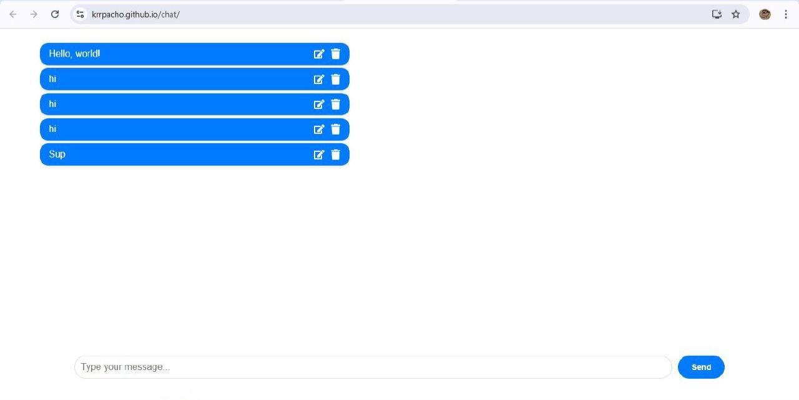

# Anonymous Chat Web Application

## Overview
A simple and interactive chat web application where anyone can:
- Send anonymous messages.
- Edit messages after posting.
- Delete messages when needed.

## Tech Stack
- **Frontend**: React.js
- **Backend**: Spring Boot
- **Database**: PostgreSQL (hosted online)
- **Hosting**:
  - Frontend: GitHub Pages
  - Backend: Render

## Features
- **Anonymous Messaging**: Users remain completely anonymous while sending messages.
- **Edit Messages**: Modify previously posted messages.
- **Delete Messages**: Remove any posted message.

## Contributing

Contributions to this project are welcome! If you'd like to contribute, please follow these guidelines:
- **Fork the repository** and create a pull request with your changes.
- **Submit issues** for any bugs or feature requests.
  
## To Run;

### `cd my-app`
### `npm start`

#### The backend: https://github.com/krrpacho/chatback
